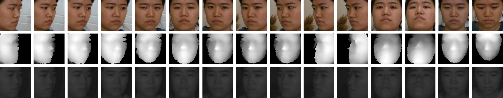

# CAS-AIR-3D-Face

[CAS-AIR-3D Face: A Low-Quality, Multi-Modal and Multi-Pose 3D Face Database](https://ieeexplore.ieee.org/document/9484332)

Benefiting from deep learning with large scale face databases, 
2D face recognition has made significant progress in recent years. 
However, it still highly depends on lighting conditions and human poses, 
and suffers from face spoofing problem. In contrast, 3D face recognition 
reveals a new path that can overcome the previous limitations of 2D face 
recognition. One of the most important problems for 3D face recognition 
is to construct a suitable database, which can be exploited to train different 
3D face recognition algorithms. In this work, we propose a new database, 
CAS-AIR-3D Face, for low-quality 3D face recognition. 
It includes 24713 videos from 3093 individuals, which is captured by Intel 
RealSense SR305. The database contains three modalities: color, depth and 
near infrared, and is rich in pose, expression, occlusion and distance variations.

 

### Download

If you need to download it, please complete this 
[agreement](license/CAS-AIR-3D%20Face%20License%20Agreement.pdf) *(The agreement refers 
to the dataset license agreement of Idiap Research Institute)*, and send the scanned 
version with the signature of a permanent staff to `cripac_3dface@cripac.ia.ac.cn`.

### Contact and Citation

If you have any question, please email to `cripac_3dface@cripac.ia.ac.cn`

Please cite our paper when you use it in your research.
```
@INPROCEEDINGS{CAS-AIR-3D Face,
  author={Li, Qi and Dong, Xiaoxiao and Wang, Weining and Shan, Caifeng},
  booktitle={2021 IEEE International Joint Conference on Biometrics (IJCB)}, 
  title={CAS-AIR-3D Face: A Low-Quality, Multi-Modal and Multi-Pose 3D Face Database}, 
  year={2021},
  pages={1-8}
}
```